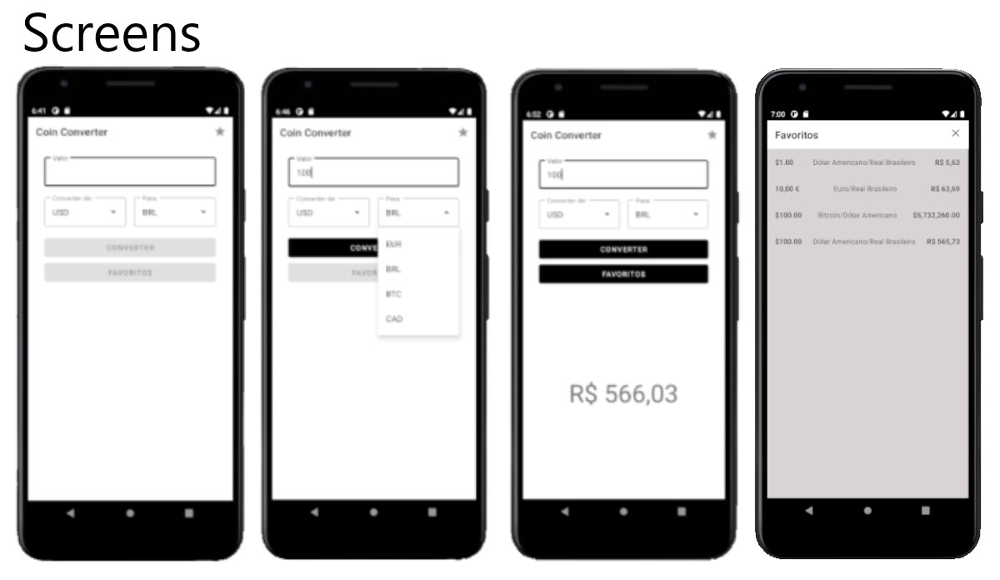

# Coin Converter App 

This was the project delivered at Bootcamp Carrefour Android Developer at DIO.

The project aims to create a currency converter App in Kotlin.

In this project, View Binding, RecyclerView, MVVM, Coroutines, and Retrofit were used. For this, we used SQLite using Room.

It was implemented new features as Challenge for example when the user selects the coin in the first dropdown. He can't select the same coin in the second one. Because there is no option for this in the second one. As well I implemented some changes in the favorite activity.

Feel free to look, I am open to tips and suggestions.

